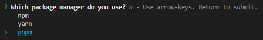
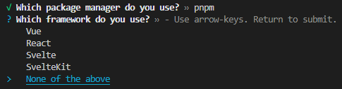
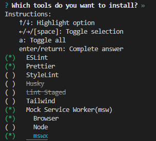

# lai-cmd

這是一個用於生成網頁開發環境的 CLI，他基於 npx。

[English](https://github.com/LaiJunBin/lai-cmd/tree/develop#lai-cmd)｜繁體中文

---

## 🚨 **專案維護更新說明** 🚨
> 因應 ESLint 重大升級至 9.x 版本，以及目前前端初始化工具生態日益成熟（不再需要繁重的環境設定），因此決定暫時停止維護此專案。

## 環境要求
* Node.js >= 18.0.0

## 使用方式:

```
$ npx lai-cmd@latest init
```

### 選擇套件管理器


### 選擇框架


### 選擇要裝的套件


---

## 支援安裝的套件
- [x] [Vue](https://vuejs.org/)
  - [x] [ESLint](https://eslint.org/)
  - [x] [Prettier](https://prettier.io/)
  - [x] [StyleLint](https://stylelint.io/)
  - [x] [Husky (pre-commit)](https://typicode.github.io/husky/)
  - [x] [Lint-Staged](https://github.com/okonet/lint-staged)
  - [x] [Tailwind](https://tailwindcss.com/)
  - [x] [Mock Service Worker](https://mswjs.io/)
    - [x] [Browser](https://mswjs.io/docs/getting-started/integrate/browser)
    - [x] [Node](https://mswjs.io/docs/getting-started/integrate/node)
    - [x] [mswx](https://github.com/LaiJunBin/mswx)
- [x] [React](https://react.dev/)
  - [x] [ESLint](https://eslint.org/)
  - [x] [Prettier](https://prettier.io/)
  - [x] [StyleLint](https://stylelint.io/)
  - [x] [Husky (pre-commit)](https://typicode.github.io/husky/)
  - [x] [Lint-Staged](https://github.com/okonet/lint-staged)
  - [x] [Tailwind](https://tailwindcss.com/)
  - [x] [Testing-Library](https://testing-library.com/)
    - [x] Add Testing Library Example
  - [x] [Mock Service Worker](https://mswjs.io/)
    - [x] [Browser](https://mswjs.io/docs/getting-started/integrate/browser)
    - [x] [Node](https://mswjs.io/docs/getting-started/integrate/node)
    - [x] [mswx](https://github.com/LaiJunBin/mswx)
- [x] [Svelte](https://svelte.dev/)
  - [x] [ESLint](https://eslint.org/)
  - [x] [Prettier](https://prettier.io/)
  - [x] [StyleLint](https://stylelint.io/)
  - [x] [Husky (pre-commit)](https://typicode.github.io/husky/)
  - [x] [Lint-Staged](https://github.com/okonet/lint-staged)
  - [x] [Tailwind](https://tailwindcss.com/)
  - [x] [Testing-Library](https://testing-library.com/)
    - [x] Add Testing Library Example
  - [x] [Mock Service Worker](https://mswjs.io/)
    - [x] [Browser](https://mswjs.io/docs/getting-started/integrate/browser)
    - [x] [Node](https://mswjs.io/docs/getting-started/integrate/node)
    - [x] [mswx](https://github.com/LaiJunBin/mswx)
- [x] [SvelteKit](https://kit.svelte.dev/)
  - [x] [ESLint](https://eslint.org/)
  - [x] [Prettier](https://prettier.io/)
  - [x] [StyleLint](https://stylelint.io/)
  - [x] [Husky (pre-commit)](https://typicode.github.io/husky/)
  - [x] [Lint-Staged](https://github.com/okonet/lint-staged)
  - [x] [Tailwind](https://tailwindcss.com/)
  - [x] [Testing-Library](https://testing-library.com/)
    - [x] Add Testing Library Example
  - [x] [Mock Service Worker](https://mswjs.io/)
    - [x] [Browser](https://mswjs.io/docs/getting-started/integrate/browser)
    - [x] [Node](https://mswjs.io/docs/getting-started/integrate/node)
    - [x] [mswx](https://github.com/LaiJunBin/mswx)
- [x] Others (Vanilla)
  - [x] [ESLint](https://eslint.org/)
  - [x] [Prettier](https://prettier.io/)
  - [x] [StyleLint](https://stylelint.io/)
  - [x] [Husky (pre-commit)](https://typicode.github.io/husky/)
  - [x] [Lint-Staged](https://github.com/okonet/lint-staged)
  - [x] [Tailwind](https://tailwindcss.com/)
  - [x] [Mock Service Worker](https://mswjs.io/)
    - [x] [Browser](https://mswjs.io/docs/getting-started/integrate/browser)
    - [x] [Node](https://mswjs.io/docs/getting-started/integrate/node)
    - [x] [mswx](https://github.com/LaiJunBin/mswx)
